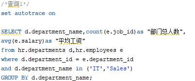
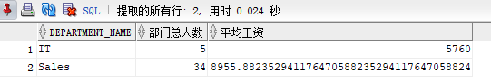
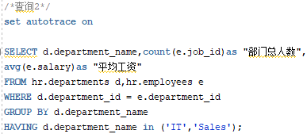
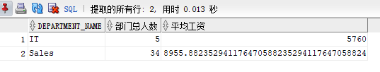
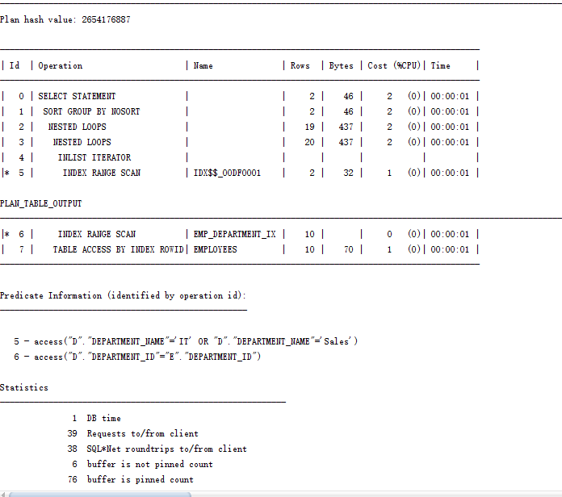
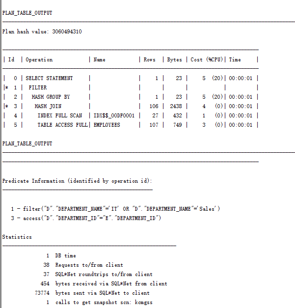
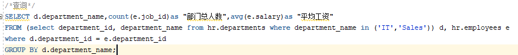
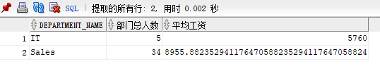

# 实验1： SQL语句的执行计划分析与优化指导

## 王炜清 软件18-3 学号：201810414321

github用户名：997Yi

### 教材查询语句

- 查询1

> 代码
>
> > 
>
> 运行结果
>
> > 

- 查询2
> 代码
>
> > 
>
> 运行结果
>
> > 

- 分析

> 查询1执行计划
>
> > 
>
> 查询2执行计划
>
> > 
>
> 查询1循环影响行数20行，CPU占用2%
>
> 查询2 hash join影响106行，CPU占用5%
>
> 从影响行数和CPU占用来说，查询1的方法更好

### 设计查询语句

- 查询

> 代码
>
> > 
>
> 运行结果
>
> > 

- 分析

> 对department优先查询，先筛选出department中符合条件的id和name，再进行连表查询。