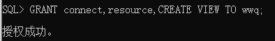
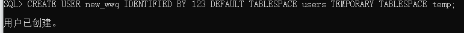

# 实验2：用户及权限管理

## 王炜清 软件18-3 学号：201810414321

角色：wwq

用户：new_wwq

### 成功连接

### 创建角色

### 用户创建及角色分配

### 连接到new_wwq

### 表空间分配、对象创建及共享的设置

### 连接到hr

### 数据库和表空间占用分析

> 当全班同学的实验都做完之后，数据库pdborcl中包含了每个同学的角色和用户。 所有同学的用户都使用表空间users存储表的数据。 表空间中存储了很多相同名称的表mytable和视图myview，但分别属性于不同的用户，不会引起混淆。 随着用户往表中插入数据，表空间的磁盘使用量会增加。

### 查看数据库的使用情况

