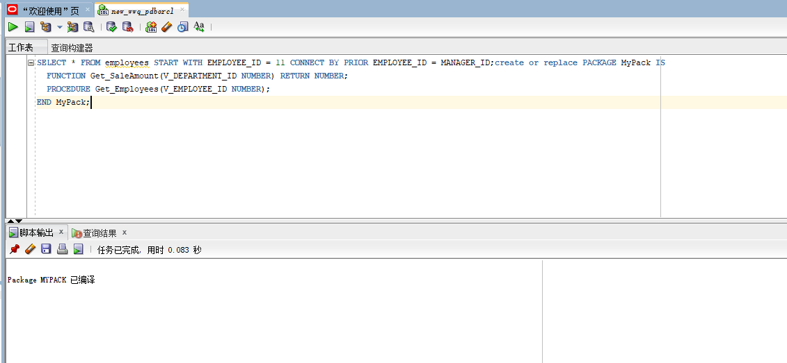
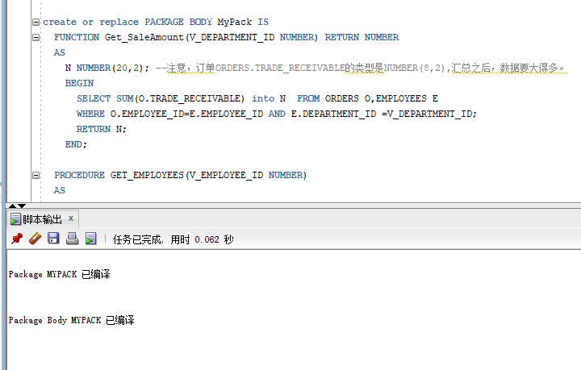
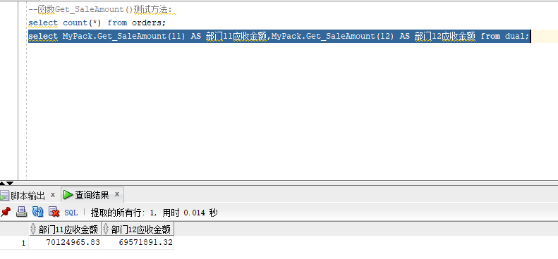
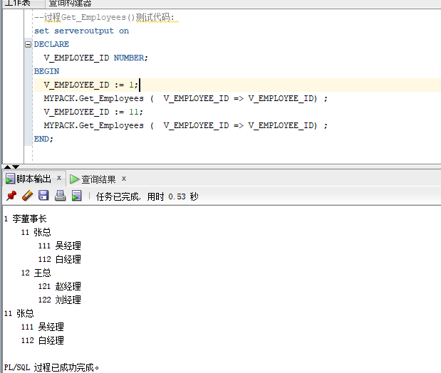

# 实验5：PL/SQL编程

王炜清 软件18-3 学号：201810414321
---

github用户名：997Yi

数据库用户名：new_wwq

### 实验目的

```
了解PL/SQL语言结构
了解PL/SQL变量和常量的声明和使用方法
学习条件语句的使用方法
学习分支语句的使用方法
学习循环语句的使用方法
学习常用的PL/SQL函数
学习包，过程，函数的用法。
```

### 实验场景

- 假设有一个生产某个产品的单位，单位接受网上订单进行产品的销售。通过实验模拟这个单位的部分信息：员工表，部门表，订单表，订单详单表。
- 本实验以实验四为基础

### 实验步骤

#### 1、创建一个myPack包，其中包含函数SaleAmount和一个存储过程

	

```sql
create or replace PACKAGE MyPack IS
  FUNCTION Get_SaleAmount(V_DEPARTMENT_ID NUMBER) RETURN NUMBER;
  PROCEDURE Get_Employees(V_EMPLOYEE_ID NUMBER);
END MyPack;
```

#### 2、编写SaleAmount函数

```sql
FUNCTION Get_SaleAmount(V_DEPARTMENT_ID NUMBER) RETURN NUMBER AS N NUMBER(20,2);
BEGIN
	-- 通过传入的V_DEPARTMENT_ID部门id，连接所有部门中的员工，并获取他们的销售金额总和
  SELECT SUM(O.TRADE_RECEIVABLE) into N  FROM ORDERS O,EMPLOYEES E
  WHERE O.EMPLOYEE_ID=E.EMPLOYEE_ID AND E.DEPARTMENT_ID =V_DEPARTMENT_ID;
  RETURN N;
END;
```

#### 3、实现存储过程

```sql
PROCEDURE GET_EMPLOYEES(V_EMPLOYEE_ID NUMBER) AS LEFTSPACE VARCHAR(2000);
BEGIN

		LEFTSPACE:=' ';
		-- 通过游标输出员工的ID,姓名，销售总金额
		for v in
				(SELECT LEVEL,EMPLOYEE_ID,NAME,MANAGER_ID FROM employees
					START WITH EMPLOYEE_ID = V_EMPLOYEE_ID
					CONNECT BY PRIOR EMPLOYEE_ID = MANAGER_ID)
		LOOP
			DBMS_OUTPUT.PUT_LINE(LPAD(LEFTSPACE,(V.LEVEL-1)*4,' ')||
													 V.EMPLOYEE_ID||' '||v.NAME);
		END LOOP;
END;
```

#### 4、在包中添加函数和存储过程



```sql
create or replace PACKAGE BODY MyPack IS
  FUNCTION Get_SaleAmount(V_DEPARTMENT_ID NUMBER) RETURN NUMBER AS N NUMBER(20,2);
  BEGIN
    -- 通过传入的V_DEPARTMENT_ID部门id，连接所有部门中的员工，并获取他们的销售金额总和
    SELECT SUM(O.TRADE_RECEIVABLE) into N  FROM ORDERS O,EMPLOYEES E
    WHERE O.EMPLOYEE_ID=E.EMPLOYEE_ID AND E.DEPARTMENT_ID =V_DEPARTMENT_ID;
    RETURN N;
  END;

  PROCEDURE GET_EMPLOYEES(V_EMPLOYEE_ID NUMBER) AS LEFTSPACE VARCHAR(2000);
  BEGIN

      LEFTSPACE:=' ';
      -- 通过游标输出员工的ID,姓名，销售总金额
      for v in
          (SELECT LEVEL,EMPLOYEE_ID,NAME,MANAGER_ID FROM employees
            START WITH EMPLOYEE_ID = V_EMPLOYEE_ID
            CONNECT BY PRIOR EMPLOYEE_ID = MANAGER_ID)
      LOOP
        DBMS_OUTPUT.PUT_LINE(LPAD(LEFTSPACE,(V.LEVEL-1)*4,' ')||
                             V.EMPLOYEE_ID||' '||v.NAME);
      END LOOP;
  END;
END MyPack;
```

#### 5、测试

测试SaleAmount函数



```sql
select 	MyPack.Get_SaleAmount(11) AS 部门11应收金额, 
				MyPack.Get_SaleAmount(12) AS 部门12应收金额 
from dual;
```

测试存储过程：



```sql
DECLARE
  V_EMPLOYEE_ID NUMBER;    
BEGIN
  V_EMPLOYEE_ID := 1;
  MYPACK.Get_Employees (  V_EMPLOYEE_ID => V_EMPLOYEE_ID) ;  
  V_EMPLOYEE_ID := 11;
  MYPACK.Get_Employees (  V_EMPLOYEE_ID => V_EMPLOYEE_ID) ;    
END;
```


